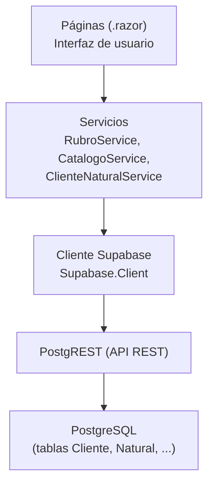
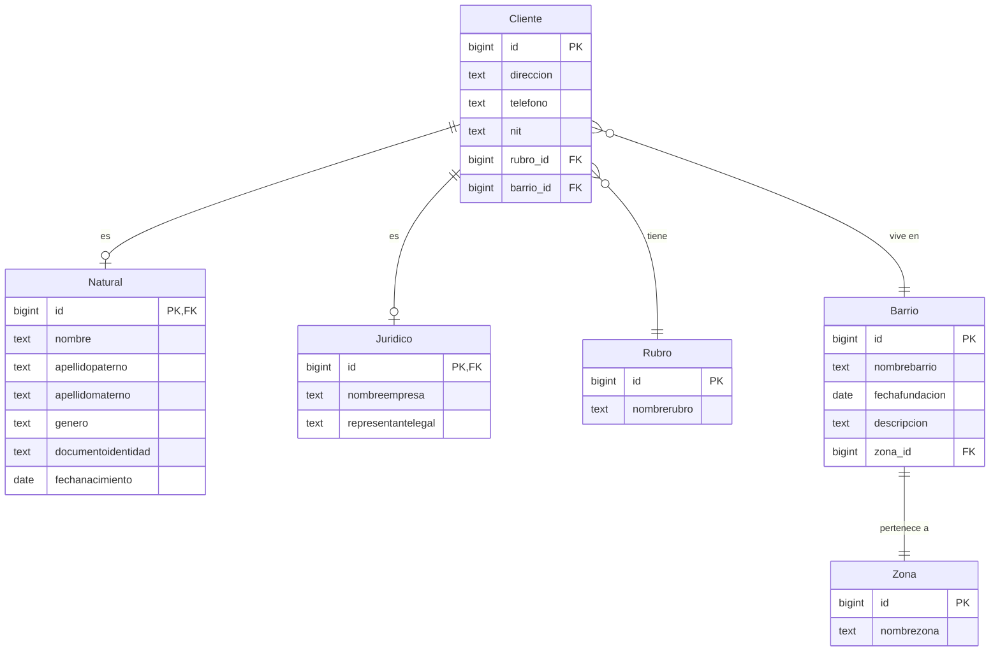

# Documentación de DSSeptiembre

> Sistema de gestión de clientes desarrollado con **Blazor WebAssembly** y **Supabase**.
> Este documento explica, de forma simple pero completa, **cómo funciona todo el código**, parte por parte, para que cualquier persona (aunque nunca haya visto el proyecto) pueda entenderlo y modificarlo.

---

## Índice

1. [¿Qué es DSSeptiembre?](#1-qué-es-dsseptiembre)
2. [Tecnologías y requisitos](#2-tecnologías-y-requisitos)
3. [Estructura del proyecto](#3-estructura-del-proyecto)
4. [Arquitectura general](#4-arquitectura-general)
5. [Base de datos: tablas y relaciones](#5-base-de-datos-tablas-y-relaciones)
6. [Arranque y configuración](#6-arranque-y-configuración)
7. [Modelos de dominio](#7-modelos-de-dominio)
8. [Servicios e interfaces](#8-servicios-e-interfaces)
9. [Componentes y layout](#9-componentes-y-layout)
10. [Páginas (historias de usuario)](#10-páginas-historias-de-usuario)
11. [Impresión](#11-impresión)
12. [Decisiones técnicas y puntos clave](#12-decisiones-técnicas-y-puntos-clave)
13. [Solución de problemas](#13-solución-de-problemas)
14. [Ejemplo completo: crear un cliente natural](#14-ejemplo-completo-crear-un-cliente-natural)
15. [Glosario](#15-glosario)

---

## 1. ¿Qué es DSSeptiembre?

Es una aplicación web (**SPA**, funciona entera en el navegador) para administrar clientes de una empresa. Permite registrar rubros y clientes naturales, ver un panel de resumen e imprimir documentos (panel, kardex y listados).

El sistema está organizado en **5 historias de usuario (HU)**:

| Código | Historia | Ruta en la app | Página |
|--------|----------|----------------|--------|
| **R001** | Registrar rubro | `/rubros` | `Pages/Rubros.razor` |
| **R002** | Gestionar cliente natural | `/clientes-naturales` | `Pages/ClientesNaturales.razor` |
| **R003** | Imprimir panel de clientes | `/panel-clientes` | `Pages/PanelClientes.razor` |
| **R004** | Imprimir kardex de cliente natural | `/kardex/{Id}` | `Pages/KardexClienteNatural.razor` |
| **R005** | Imprimir listado de clientes naturales | `/clientes-naturales/imprimir` | `Pages/ListadoClientesNaturales.razor` |

Además hay una página de inicio (`/`) que enlaza a todo, y una página de "no encontrado".

---

## 2. Tecnologías y requisitos

| Elemento | Detalle |
|----------|---------|
| Framework | **Blazor WebAssembly** (`net10.0`) |
| SDK del proyecto | `Microsoft.NET.Sdk.BlazorWebAssembly` |
| Backend / Base de datos | **Supabase** (PostgreSQL + PostgREST) |
| Cliente C# | paquete NuGet **`Supabase` 1.1.1** |
| Serialización | **Newtonsoft.Json** 13.0.3 (viene con Supabase) |
| HTTP interno | `Supabase.Postgrest` 4.0.3 (viene con Supabase) |
| Estilos / UI | **Tailwind CSS por CDN** (no requiere instalación) |
| Impresión | JavaScript del navegador (`window.print()`) |

**Requisitos para ejecutar:**

- [.NET SDK 10](https://dotnet.microsoft.com/) instalado.
- Una cuenta/proyecto de **Supabase** con las tablas del [punto 5](#5-base-de-datos-tablas-y-relaciones).

**Comandos útiles:**

```bash
dotnet build     # compila
dotnet run       # ejecuta (levanta el sitio en localhost)
dotnet clean     # limpia bin/ y obj/ (útil si hay caché rara)
```

En VS Code existe además la tarea **`build`** (ver `.vscode/tasks.json`) que ejecuta `dotnet build`.

---

## 3. Estructura del proyecto

```
DSSeptiembre/
├── DSSeptiembre.csproj        # Configuración del proyecto y paquetes NuGet
├── Program.cs                 # Punto de entrada: arranca Blazor y conecta Supabase
├── App.razor                  # Router principal (decide qué página mostrar)
├── _Imports.razor             # @using globales disponibles en TODOS los .razor
├── DOCUMENTACION.md           # Este documento
│
├── Layout/
│   └── MainLayout.razor       # Plantilla visual: cabecera, menú y @Body
│
├── Pages/                     # Una página por cada pantalla/ruta
│   ├── Home.razor             # "/"        Inicio con accesos a las HU
│   ├── Rubros.razor           # "/rubros"  R001
│   ├── ClientesNaturales.razor# "/clientes-naturales" R002
│   ├── PanelClientes.razor    # "/panel-clientes" R003
│   ├── KardexClienteNatural.razor # "/kardex/{Id}" R004
│   ├── ListadoClientesNaturales.razor # "/clientes-naturales/imprimir" R005
│   └── NotFound.razor         # "/not-found"
│
├── Shared/
│   ├── Configuration/
│   │   └── SupabaseConfiguration.cs   # Clase para leer Url/Key del appsettings
│   │
│   ├── Domain/                        # MODELOS de la base de datos
│   │   ├── Cliente.cs
│   │   ├── Natural.cs
│   │   ├── Juridico.cs
│   │   ├── Rubro.cs
│   │   ├── Barrio.cs
│   │   └── Zona.cs
│   │
│   ├── Interface/                     # CONTRATOS de los servicios
│   │   ├── IRubroService.cs
│   │   ├── ICatalogoService.cs
│   │   └── IClienteNaturalService.cs
│   │
│   ├── Service/                       # LÓGICA de acceso a datos
│   │   ├── RubroService.cs
│   │   ├── CatalogoService.cs
│   │   └── ClienteNaturalService.cs
│   │
│   └── Components/
│       └── PrintButton.razor          # Botón reutilizable de impresión
│
└── wwwroot/                   # Archivos estáticos que ve el navegador
    ├── index.html             # HTML base (carga Blazor y Tailwind)
    ├── appsettings.json       # Credenciales de Supabase (Url y Key)
    └── css/app.css            # Estilos base de Blazor
```

> **Nota:** los archivos `Shared/Interface/IProductService.cs` y `Shared/Service/ProductService.cs` existen pero están **vacíos**; son restos de una versión anterior y no se usan.

---

## 4. Arquitectura general

La app sigue una arquitectura en **3 capas** muy clara. Cada capa solo habla con la siguiente:



| Capa | Archivos | Responsabilidad |
|------|----------|-----------------|
| **Páginas** | `Pages/*.razor` | Mostrar datos, capturar formularios, mostrar mensajes. **No** saben SQL. |
| **Servicios** | `Shared/Service/*.cs` | Hacer las consultas a Supabase y "armar" los objetos. |
| **Modelos** | `Shared/Domain/*.cs` | Representar las tablas de la base de datos en C#. |
| **Configuración** | `Program.cs`, `appsettings.json` | Conectar con Supabase y registrar los servicios. |

### Ideas importantes de diseño

- **No se usan DTOs** (clases intermedias de transferencia). Se reutilizan directamente los **modelos de dominio**. Las relaciones (por ejemplo, un `Cliente` con su `Rubro`) se **cargan y enlazan en memoria** dentro de los servicios.
- **Inyección de dependencias (DI):** las páginas reciben los servicios por constructor (con `@inject`), y los servicios reciben el cliente de Supabase.
  - El cliente de Supabase se registra como **Singleton** (una sola instancia para toda la app).
  - Los servicios se registran como **Scoped** (una instancia por sesión de usuario).
- **Todo corre en el navegador.** La `Key` de Supabase que se usa es una *publishable key*, protegida por las políticas **RLS** (Row Level Security) del lado del servidor.

---

## 5. Base de datos: tablas y relaciones

### Diagrama de relaciones



### Reglas del modelo

1. **`Cliente` es la tabla "padre".** Guarda los datos comunes a cualquier cliente (dirección, teléfono, NIT, rubro, barrio).
2. **`Natural` y `Juridico` son tablas "hijas".** Su `id` es **a la vez** clave primaria y clave foránea hacia `Cliente.id`. Un cliente natural es un `Cliente` + una fila en `Natural`.
3. **Borrado en cascada:** al borrar un `Cliente`, PostgreSQL borra automáticamente su fila en `Natural` o `Juridico` (`ON DELETE CASCADE`). Por eso en el código solo se borra el `Cliente`.
4. **`Barrio` y `Zona` son 1 a 1:** cada barrio pertenece a una única zona (`Barrio.zona_id` es `UNIQUE NOT NULL`).
5. **Nombres de columnas en minúsculas** (`nombrebarrio`, `rubro_id`, ...) porque la base se creó sin comillas. Los nombres de **tabla** van con mayúscula inicial (`Cliente`, `Natural`, ...).

### Tabla de campos

#### Cliente

| Campo C# | Columna BD | Tipo | Nulo | Descripción |
|----------|-----------|------|------|-------------|
| `Id` | `id` | bigint | No | PK, autogenerado |
| `Direccion` | `direccion` | text | Sí | Dirección |
| `Telefono` | `telefono` | text | Sí | Teléfono |
| `Nit` | `nit` | text | Sí | NIT |
| `RubroId` | `rubro_id` | bigint | Sí | FK a `Rubro` |
| `BarrioId` | `barrio_id` | bigint | Sí | FK a `Barrio` |

#### Natural

| Campo C# | Columna BD | Tipo | Nulo | Descripción |
|----------|-----------|------|------|-------------|
| `Id` | `id` | bigint | No | PK **y** FK a `Cliente.id` |
| `Nombre` | `nombre` | text | No | Nombre (obligatorio) |
| `ApellidoPaterno` | `apellidopaterno` | text | Sí | Apellido paterno |
| `ApellidoMaterno` | `apellidomaterno` | text | Sí | Apellido materno |
| `Genero` | `genero` | text | Sí | Género |
| `DocumentoIdentidad` | `documentoidentidad` | text | Sí | Documento (CI) |
| `FechaNacimiento` | `fechanacimiento` | date | Sí | Fecha de nacimiento |

#### Juridico

| Campo C# | Columna BD | Tipo | Nulo | Descripción |
|----------|-----------|------|------|-------------|
| `Id` | `id` | bigint | No | PK **y** FK a `Cliente.id` |
| `NombreEmpresa` | `nombreempresa` | text | No | Razón social |
| `RepresentanteLegal` | `representantelegal` | text | No | Representante legal |

#### Rubro

| Campo C# | Columna BD | Tipo | Nulo | Descripción |
|----------|-----------|------|------|-------------|
| `Id` | `id` | bigint | No | PK, autogenerado |
| `NombreRubro` | `nombrerubro` | text | No | Nombre del rubro |

#### Barrio

| Campo C# | Columna BD | Tipo | Nulo | Descripción |
|----------|-----------|------|------|-------------|
| `Id` | `id` | bigint | No | PK, autogenerado |
| `NombreBarrio` | `nombrebarrio` | text | No | Nombre del barrio |
| `FechaFundacion` | `fechafundacion` | date | Sí | Fecha de fundación |
| `Descripcion` | `descripcion` | text | Sí | Descripción |
| `ZonaId` | `zona_id` | bigint | No | FK a `Zona` (única) |

#### Zona

| Campo C# | Columna BD | Tipo | Nulo | Descripción |
|----------|-----------|------|------|-------------|
| `Id` | `id` | bigint | No | PK, autogenerado |
| `NombreZona` | `nombrezona` | text | No | Nombre de la zona |

### SQL de referencia

> Script de referencia para recrear el esquema. El orden importa: primero las tablas referenciadas (`Rubro`, `Zona`, `Barrio`) y luego `Cliente`, `Natural`, `Juridico`.

```sql
CREATE TABLE "Rubro" (
    id          BIGSERIAL PRIMARY KEY,
    nombrerubro TEXT NOT NULL
);

CREATE TABLE "Zona" (
    id         BIGSERIAL PRIMARY KEY,
    nombrezona TEXT NOT NULL
);

CREATE TABLE "Barrio" (
    id             BIGSERIAL PRIMARY KEY,
    nombrebarrio   TEXT NOT NULL,
    fechafundacion DATE,
    descripcion    TEXT,
    zona_id        BIGINT UNIQUE NOT NULL REFERENCES "Zona"(id)
);

CREATE TABLE "Cliente" (
    id        BIGSERIAL PRIMARY KEY,
    direccion TEXT,
    telefono  TEXT,
    nit       TEXT,
    rubro_id  BIGINT REFERENCES "Rubro"(id),
    barrio_id BIGINT REFERENCES "Barrio"(id)
);

-- El id es PK y a la vez FK. ON DELETE CASCADE borra el hijo al borrar el Cliente.
CREATE TABLE "Natural" (
    id                 BIGINT PRIMARY KEY REFERENCES "Cliente"(id) ON DELETE CASCADE,
    nombre             TEXT NOT NULL,
    apellidopaterno    TEXT,
    apellidomaterno    TEXT,
    genero             TEXT,
    documentoidentidad TEXT,
    fechanacimiento    DATE
);

CREATE TABLE "Juridico" (
    id                 BIGINT PRIMARY KEY REFERENCES "Cliente"(id) ON DELETE CASCADE,
    nombreempresa      TEXT NOT NULL,
    representantelegal TEXT NOT NULL
);
```

### Seguridad (RLS)

Supabase exige **Row Level Security**. Si las tablas tienen RLS activado sin políticas, la app recibirá **0 filas** o errores de permisos aunque los datos existan. Hay que crear políticas que permitan `SELECT`, `INSERT`, `UPDATE` y `DELETE` según corresponda (por ejemplo, permitir todo al rol `anon` solo si es un entorno de práctica).

---

## 6. Arranque y configuración

### `wwwroot/appsettings.json`

Guarda la conexión a Supabase. Se lee del lado del navegador.

```json
{
  "Supabase": {
    "Url": "<tu-url-de-supabase>",
    "Key": "<tu-publishable-key>"
  }
}
```

> ⚠️ **Seguridad:** la `Key` aquí es una *publishable key* (pensada para ser pública) y **debe** estar protegida por políticas RLS en Supabase. **Nunca** pongas la `service_role key` en el frontend.

### `Shared/Configuration/SupabaseConfiguration.cs`

Clase simple que mapea el JSON anterior:

```csharp
public class SupabaseConfiguration
{
    public string Url { get; set; } = string.Empty;
    public string Key { get; set; } = string.Empty;
}
```

### `Program.cs` (punto de entrada)

Pasos que realiza, en orden:

1. Crea el `WebAssemblyHostBuilder` y monta los componentes raíz (`App` y `HeadOutlet`).
2. Lee la sección `"Supabase"` del `appsettings.json` y la convierte en `SupabaseConfiguration`.
3. **Valida** que `Url` y `Key` no estén vacíos; si faltan, lanza una excepción clara.
4. Crea el `Client` de Supabase y llama a `InitializeAsync()`.
5. Registra el cliente (Singleton) y los tres servicios (Scoped) en el contenedor de dependencias.
6. Arranca la app con `RunAsync()`.

```csharp
var client = new Client(supabaseUrl, supabaseKey);
await client.InitializeAsync();

builder.Services.AddSingleton(client);
builder.Services.AddScoped<IRubroService, RubroService>();
builder.Services.AddScoped<ICatalogoService, CatalogoService>();
builder.Services.AddScoped<IClienteNaturalService, ClienteNaturalService>();
```

### `wwwroot/index.html`

HTML base de una app Blazor WASM. Lo importante:

- `<base href="/" />` para que funcionen las rutas.
- Carga de **Tailwind por CDN**: `<script src="https://cdn.tailwindcss.com"></script>`.
- Carga del runtime de Blazor: `_framework/blazor.webassembly.js`.
- El `<div id="app">` es donde Blazor "dibuja" toda la aplicación.

---

## 7. Modelos de dominio

Todos los modelos están en `Shared/Domain/` y **heredan de `BaseModel`** (de Supabase.Postgrest). `BaseModel` permite que el objeto se pueda usar directamente en `Insert`, `Update`, `Delete`, etc.

### Atributos que se usan

| Atributo | Para qué sirve |
|----------|----------------|
| `[Table("Nombre")]` | Indica el nombre real de la tabla en la base de datos. |
| `[PrimaryKey("id")]` | Marca la propiedad como clave primaria. |
| `[PrimaryKey("id", true)]` | Igual, pero con `shouldInsert: true` (ver abajo). |
| `[Column("nombre_columna")]` | Mapea la propiedad con el nombre de la columna. |
| `[Required]` | Validación de formulario (no permite vacío). |
| `[JsonIgnore]` | **Evita** que la propiedad se envíe/lea de la base de datos. |

### Puntos clave

- **¿Por qué `[PrimaryKey("id", true)]` en `Natural` y `Juridico`?**
  En esas tablas el `id` **no** es autogenerado: es el mismo `id` del `Cliente` recién creado (es una FK). Por defecto `PrimaryKey` **no envía** la columna `id` en los `INSERT` (`shouldInsert: false`); con `true` le decimos a Supabase que **sí incluya** ese `id` al insertar. En `Cliente`, `Rubro`, `Barrio` y `Zona` el `id` es autogenerado (`BIGSERIAL`), por eso se usa `[PrimaryKey("id")]` sin el `true`.

- **¿Por qué `[JsonIgnore]` en las propiedades de navegación?**
  La librería serializa **todas** las propiedades públicas a JSON. Las relaciones (`Rubro`, `Barrio`, `Cliente`, `Zona`, `NombreCompleto`) **no son columnas** de la tabla; si no se ignoran, la petición fallaría o enviaría datos de más. Con `[JsonIgnore]` se marcan como "no persistidas" y se llenan manualmente en memoria.

- **`Natural.NombreCompleto`** es una propiedad **calculada** (solo lectura) que une nombre + apellidos. No se guarda en la base.

### Ejemplo comentado: `Natural.cs`

```csharp
[Table("Natural")]
public class Natural : BaseModel
{
    // PK y FK a Cliente.id: debe insertarse explícitamente
    [PrimaryKey("id", true)]
    public long Id { get; set; }

    [Required(ErrorMessage = "El nombre es obligatorio.")]
    [Column("nombre")]
    public string Nombre { get; set; } = string.Empty;

    [Column("apellidopaterno")]
    public string? ApellidoPaterno { get; set; }

    [Column("apellidomaterno")]
    public string? ApellidoMaterno { get; set; }

    [Column("genero")]
    public string? Genero { get; set; }

    [Column("documentoidentidad")]
    public string? DocumentoIdentidad { get; set; }

    [Column("fechanacimiento")]
    public DateTime? FechaNacimiento { get; set; }

    // Navegación: no se persiste, se llena en el servicio
    [JsonIgnore] public Cliente? Cliente { get; set; }

    [JsonIgnore]
    public string NombreCompleto =>
        string.Join(" ", new[] { Nombre, ApellidoPaterno, ApellidoMaterno }
            .Where(p => !string.IsNullOrWhiteSpace(p)));
}
```

---

## 8. Servicios e interfaces

Cada servicio tiene su **interfaz** (el contrato) y su **implementación**. Las páginas dependen de la interfaz, no de la clase; esto facilita cambios y pruebas.

### `IRubroService` → `RubroService`

CRUD de rubros.

| Método | Qué hace |
|--------|----------|
| `GetAllAsync()` | Devuelve todos los rubros ordenados por nombre. |
| `CreateAsync(rubro)` | Inserta un rubro y devuelve el registro creado (con su `id`). |
| `UpdateAsync(rubro)` | Actualiza un rubro existente. |
| `DeleteAsync(id)` | Elimina el rubro con ese `id`. |

### `ICatalogoService` → `CatalogoService`

Solo lecturas para llenar los combos (listas desplegables) de la pantalla de clientes.

| Método | Qué hace |
|--------|----------|
| `GetRubrosAsync()` | Lista de rubros ordenada. |
| `GetBarriosAsync()` | Lista de barrios ordenada. |
| `GetZonasAsync()` | Lista de zonas ordenada. |

### `IClienteNaturalService` → `ClienteNaturalService`

Es el servicio más importante. Maneja la composición `Cliente` + `Natural`.

| Método | Qué hace |
|--------|----------|
| `GetAllAsync()` | Trae todos los clientes naturales **ya armados** (Cliente + Rubro + Barrio + Zona). |
| `GetByIdAsync(id)` | Trae un cliente natural completo por su `id`. |
| `CreateAsync(cliente, natural)` | Inserta primero el `Cliente`, toma su `id`, lo asigna al `Natural` y lo inserta. |
| `UpdateAsync(cliente, natural)` | Actualiza el `Cliente` y el `Natural`. |
| `DeleteAsync(id)` | Borra el `Cliente` (la cascada borra el `Natural`). |
| `CountNaturalesAsync()` | Cuenta clientes naturales. |
| `CountJuridicosAsync()` | Cuenta clientes jurídicos. |

#### Métodos internos clave

- **`Componer(...)`**: recibe las listas planas (`naturales`, `clientes`, `rubros`, `barrios`, `zonas`) y las cruza en memoria usando diccionarios por `id`. Así cada `Natural` queda con su `Cliente`, y cada `Cliente` con su `Rubro` y `Barrio` (y el `Barrio` con su `Zona`). Es el "pegamento" que reemplaza a un JOIN de SQL.
- **`Normalizar(cliente)`**: convierte cadenas vacías o con solo espacios (`"   "`) en `null`, para no guardar basura en la base.

#### ¿Por qué se usa `Match(...)` y no `Where(x => x.Id == id)`?

La versión instalada de `Supabase.Postgrest` (**4.0.3**) **no soporta** comparar tipos `long` dentro de expresiones LINQ `Where`. Para evitar ese problema, se filtra con un **diccionario**:

```csharp
var filtro = new Dictionary<string, string> { ["id"] = id.ToString() };
var natural = (await _supabase.From<Natural>().Match(filtro).Get()).Models.FirstOrDefault();
```

Esto genera internamente `id=eq.<valor>` y funciona correctamente con `long`.

#### Detalle: crear un cliente natural

```csharp
public async Task<Natural> CreateAsync(Cliente cliente, Natural natural)
{
    Normalizar(cliente);

    // 1) Insertar el Cliente. Supabase devuelve el registro con el id generado.
    var clienteCreado = (await _supabase.From<Cliente>().Insert(cliente)).Models.First();

    // 2) Usar ese id como id del Natural (que es PK y FK).
    natural.Id = clienteCreado.Id;
    var naturalCreado = (await _supabase.From<Natural>().Insert(natural)).Models.First();

    return naturalCreado;
}
```

> `Insert` devuelve el registro insertado por defecto (internamente usa `Prefer: return=representation`), por eso se puede leer `clienteCreado.Id`.

---

## 9. Componentes y layout

### `App.razor` — el enrutador

Define qué página mostrar según la URL:

```razor
<Router AppAssembly="@typeof(App).Assembly" NotFoundPage="typeof(Pages.NotFound)">
    <Found Context="routeData">
        <RouteView RouteData="@routeData" DefaultLayout="@typeof(MainLayout)"/>
        <FocusOnNavigate RouteData="@routeData" Selector="h1" />
    </Found>
</Router>
```

- `DefaultLayout` indica que todas las páginas usan `MainLayout`.
- `NotFoundPage` muestra `Pages/NotFound.razor` si la ruta no existe.

### `Layout/MainLayout.razor` — la plantilla visual

Contiene:

- Un **encabezado** con el logo y el menú (`NavLink` a Rubros, Clientes Naturales y Panel).
- El `<main>` con `@Body`, que es donde se inserta cada página.
- Clases `print:hidden` para que el menú **no** salga al imprimir.

### `Shared/Components/PrintButton.razor` — botón de impresión

Componente reutilizable que llama al JavaScript del navegador:

```razor
@inject IJSRuntime Js

<button type="button" class="@CssClass" @onclick="Imprimir">
    @Texto
</button>

@code {
    [Parameter] public string Texto { get; set; } = "Imprimir";
    [Parameter] public string CssClass { get; set; } = "...";

    private async Task Imprimir()
    {
        await Js.InvokeVoidAsync("print"); // abre el diálogo de impresión del navegador
    }
}
```

### `_Imports.razor` — using globales

Lista de `@using` que aplican a **todos** los `.razor` del proyecto. Gracias a esto no hay que importar en cada página:

- Namespaces de Blazor (`Forms`, `Routing`, `Web`, `JSInterop`, ...).
- Los del propio proyecto: `Shared.Domain`, `Shared.Interface`, `Shared.Service`, `Shared.Components`, `Shared.Configuration`.

> Si aparece la advertencia "Found markup element with unexpected name 'PageTitle'/'PrintButton'", normalmente es estado desactualizado del editor: esos namespaces **ya están** en `_Imports.razor`. Ver [punto 13](#13-solución-de-problemas).

---

## 10. Páginas (historias de usuario)

Todas las páginas siguen un patrón parecido: cargan datos en `OnInitializedAsync`, muestran mensajes de éxito/error, y usan Tailwind para el diseño.

### `Home.razor` — `/` (Inicio)

Página de bienvenida con tarjetas que enlazan a cada HU. No tiene lógica de datos.

### `Rubros.razor` — `/rubros` (R001)

- **Servicios inyectados:** `IRubroService`, `IJSRuntime`.
- **Estado:** `rubros` (lista), `modelo` (formulario), `editando` (rubro en edición), `mensaje`/`esError`.
- **Flujo:**
  - **Cargar:** `CargarAsync()` llama a `GetAllAsync()`.
  - **Guardar:** si `editando` es `null` → `CreateAsync`; si no → `UpdateAsync`. Luego recarga la lista.
  - **Editar:** copia el rubro seleccionado al formulario.
  - **Eliminar:** pide confirmación con `confirm` de JS y llama a `DeleteAsync`.
- Usa `<EditForm>`, `<InputText>` y `<ValidationMessage>` para el formulario validado.

### `ClientesNaturales.razor` — `/clientes-naturales` (R002)

La pantalla más compleja.

- **Servicios inyectados:** `IClienteNaturalService`, `ICatalogoService`, `IJSRuntime`, `NavigationManager`.
- **Estado:** `clientes`, `rubros`, `barrios`, `zonas`, `clienteModelo`, `naturalModelo`, `editandoId`, `busqueda`.
- **Flujo:**
  - **Cargar catálogos:** rubros, barrios y zonas (y enlaza cada barrio con su zona).
  - **Cargar clientes:** `GetAllAsync()` (ya vienen con Cliente/Rubro/Barrio/Zona).
  - **Guardar (crear):** `CreateAsync(clienteModelo, naturalModelo)`.
  - **Guardar (editar):** asigna el `id` a ambos modelos y llama a `UpdateAsync`.
  - **Eliminar:** confirma y llama a `DeleteAsync`.
  - **Buscar:** filtra en memoria por nombre, documento, NIT, rubro, barrio o zona.
- Cada fila tiene enlaces/botones: **Kardex** (va a R004), **Editar** y **Eliminar**.

### `PanelClientes.razor` — `/panel-clientes` (R003)

- **Servicio inyectado:** `IClienteNaturalService`.
- **Resumen (tarjetas):** total de clientes, naturales, jurídicos y rubros distintos.
- **Agrupaciones:** clientes por rubro y por barrio/zona, con su cantidad (`IGrouping`, se cuenta con `.Count()`).
- **Listado filtrable:** por texto y por rubro/barrio.
- **Impresión:** `<PrintButton>` imprime el panel completo.

### `KardexClienteNatural.razor` — `/kardex/{Id}` (R004)

- **Servicio inyectado:** `IClienteNaturalService`.
- Recibe el `Id` por la URL (`[Parameter] public long Id`).
- Muestra la **ficha completa** (datos personales + datos de cliente) y calcula la **edad** a partir de la fecha de nacimiento.
- **Nota:** como el sistema aún no registra movimientos, la sección "Movimientos" es solo informativa.

### `ListadoClientesNaturales.razor` — `/clientes-naturales/imprimir` (R005)

- **Servicio inyectado:** `IClienteNaturalService`.
- Muestra una **tabla completa** de clientes naturales (nombre, documento, NIT, rubro, barrio/zona, teléfono) lista para imprimir.

---

## 11. Impresión

No se usa ninguna librería externa. Todo se basa en el navegador:

1. `PrintButton.razor` ejecuta `window.print()` mediante `IJSRuntime`.
2. Tailwind aporta la variante `print:`. Las clases `print:hidden` **ocultan** elementos al imprimir (menú, botones, formularios).
3. Los contenedores de documentos usan `print:shadow-none` para que salgan limpios en papel.

Resultado: al pulsar "Imprimir", sale solo el contenido del documento (panel, kardex o listado), sin menús ni botones.

---

## 12. Decisiones técnicas y puntos clave

| Tema | Decisión / motivo |
|------|-------------------|
| **Sin DTO** | Se usan los modelos de dominio directamente; las relaciones se arman en memoria (`Componer`). Menos clases, más simple. |
| **`long` vs `Where`** | Postgrest 4.0.3 no soporta `long` en LINQ `Where`; se usa `Match(diccionario)`. |
| **`[JsonIgnore]` obligatorio** | La librería serializa todas las propiedades públicas; las navegaciones deben ignorarse. |
| **`shouldInsert: true`** | `Natural`/`Juridico` deben enviar su `id` en el `INSERT` porque es FK, no autogenerado. |
| **Borrado en cascada** | Al borrar el `Cliente`, la base borra `Natural`/`Juridico`. El código solo borra `Cliente`. |
| **Tailwind por CDN** | No hay build de CSS; se carga desde internet. Rápido de prototipar. |
| **Cliente Singleton / Servicios Scoped** | Una conexión a Supabase; un servicio por sesión de usuario. |
| **RLS** | La seguridad real vive en Supabase; el frontend usa una publishable key. |
| **Newtonsoft.Json transitivo** | Lo trae Supabase; se usa en `[JsonIgnore]`. |

---

## 13. Solución de problemas

| Síntoma | Causa probable | Solución |
|---------|----------------|----------|
| Al arrancar: *"Falta la configuración de Supabase"* | `wwwroot/appsettings.json` sin `Url`/`Key` | Completar el JSON. |
| La app muestra "No se pudieron cargar..." o listas vacías | RLS activado sin políticas, o credenciales incorrectas | Crear políticas RLS / revisar key y URL. |
| Advertencia *"Found markup element with unexpected name 'PageTitle'/'PrintButton'"* | Estado desactualizado del editor (IntelliSense/Razor Language Server), sobre todo tras errores de compilación o al editar `_Imports.razor` | Los `@using` ya están en `_Imports.razor`. Ejecutar `dotnet build`; si sigue en el editor, `dotnet clean` + recargar la ventana / reiniciar el Razor Language Server. |
| Error al filtrar por `Id` con LINQ | `Where(x => x.Id == id)` con `long` no soportado en Postgrest 4.0.3 | Usar `Match(diccionario)` (ver punto 8). |
| Datos de relación vacíos (rubro/barrio en `null`) | Faltó llamar a `Componer` o un `id` no existe en el catálogo | Verificar `GetAllAsync`/`GetByIdAsync` y que los `id` coincidan. |
| `InputSelect` no guarda la selección | Valor del `option` no coincide con el tipo | Los `option` usan `@rubro.Id` (numérico) y la opción vacía `value=""` para `null`. |
| Caché rara tras cambios | `obj/`/`bin/` desactualizados | `dotnet clean` y volver a compilar. |

---

## 14. Ejemplo completo: crear un cliente natural

Recorrido completo de una acción, para entender cómo encajan todas las piezas.

1. **Usuario** abre `/clientes-naturales` (R002) y completa el formulario (nombre, apellidos, documento, género, fecha, teléfono, NIT, dirección, rubro, barrio).
2. La página guarda lo ingresado en dos objetos: `clienteModelo` (`Cliente`) y `naturalModelo` (`Natural`).
3. Al pulsar **Registrar**, se ejecuta `Guardar()` y como `editandoId` es `null`, llama a:
   `ClienteNaturalService.CreateAsync(clienteModelo, naturalModelo)`.
4. **`CreateAsync`:**
   1. `Normalizar(cliente)` convierte textos vacíos en `null`.
   2. `Insert(cliente)` → genera `INSERT INTO "Cliente" (...) RETURNING *`. Supabase devuelve el cliente con su nuevo `id`.
   3. Asigna `natural.Id = clienteCreado.Id`.
   4. `Insert(natural)` → `INSERT INTO "Natural" (id, nombre, ...) RETURNING *`.
5. La página muestra *"Cliente natural registrado correctamente"*, limpia el formulario con `Cancelar()` y recarga la lista con `CargarAsync()`.
6. **`CargarAsync()` → `GetAllAsync()`:**
   - Consulta todas las tablas (`Natural`, `Cliente`, `Rubro`, `Barrio`, `Zona`).
   - `Componer(...)` enlaza cada `Natural` con su `Cliente`, `Rubro`, `Barrio` y `Zona`.
   - Devuelve la lista ordenada por `NombreCompleto`.
7. La tabla se vuelve a dibujar mostrando el nuevo cliente. Desde ahí se puede abrir su **Kardex** (R004), **Editar** o **Eliminar**.

---

## 15. Glosario

| Término | Significado |
|---------|-------------|
| **Blazor WebAssembly (WASM)** | Framework de .NET para crear apps web que se ejecutan **en el navegador** (C# compilado a WebAssembly). |
| **SPA** | *Single Page Application*: una sola página HTML que cambia de contenido sin recargar. |
| **Supabase** | Servicio que ofrece PostgreSQL + APIs (auth, storage, etc.) sobre tu base de datos. |
| **PostgREST** | API REST que Supabase genera automáticamente a partir de las tablas de PostgreSQL. |
| **RLS (Row Level Security)** | Seguridad a nivel de fila en PostgreSQL; decide qué filas puede ver/editar cada usuario. |
| **PK (Primary Key)** | Clave primaria: identifica de forma única cada fila. |
| **FK (Foreign Key)** | Clave foránea: referencia a la PK de otra tabla. |
| **`ON DELETE CASCADE`** | Al borrar la fila padre, se borran automáticamente las hijas. |
| **DTO** | *Data Transfer Object*: clase usada solo para transportar datos entre capas. Aquí **no** se usan. |
| **DI (Inyección de dependencias)** | Patrón por el cual los objetos reciben sus dependencias desde afuera (lo maneja Blazor). |
| **Singleton / Scoped** | Ciclos de vida en DI: Singleton = una sola instancia; Scoped = una por sesión. |
| **JSInterop** | Mecanismo de Blazor para llamar a JavaScript desde C# (aquí, `window.print()`). |
| **`@Body`, `@inject`, `@page`** | Directivas de Razor: contenido de la página, inyección de servicios y ruta de la página. |
| **`NavLink`** | Componente de Blazor para enlaces de navegación que se resaltan cuando están activos. |

---

> **Resumen final:** las **páginas** muestran la interfaz y capturan datos; los **servicios** hablan con **Supabase/PostgREST**; los **modelos** representan las **tablas**; y `Program.cs` + `appsettings.json` conectan todo. Sin DTOs, con las relaciones armadas en memoria y la impresión resuelta con `window.print()`.
